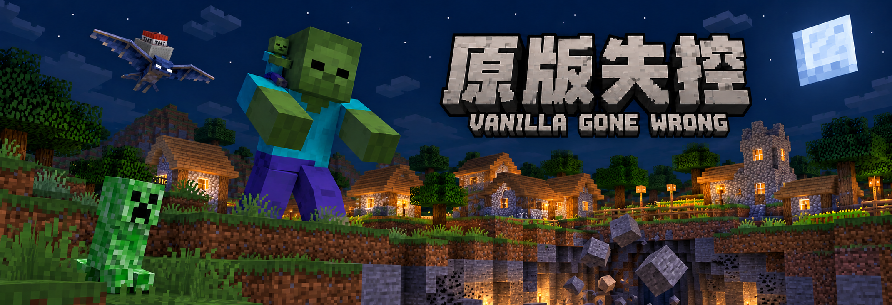

# 原版失控 · Vanilla Gone Wrong

**“让熟悉的 Minecraft 生存规则变得陌生。”**

当原版生存的节奏烂熟于心、毕业流程变得千篇一律，也许是时候让世界失去控制了。

《原版失控》在纯粹的 Minecraft Java 原版框架下，通过**200 余项底层机制的深度重构与延伸**，全面激活了你所熟悉的方块、生物与道具生态。这里没有任何突兀的模组化外来机制，却处处颠覆你的肌肉记忆。

本数据包在设计思路上借鉴了老版本 Insane Difficulty（猛男生存）数据包，希望在新版本重现那种混乱而有趣的生存体验。

| 项目 | 当前版本 |
| --- | --- |
| Minecraft | **Java 26.3** |
| 数据包格式 | **121.0** |
| 作者 | **风ノ夏** |

## 安装

1. 下载并解压源码，将同时包含 `pack.mcmeta` 和 `data/` 的整个目录放入目标世界的 `datapacks/` 文件夹。也可按下方步骤手动打包，将生成的安装 ZIP 放入 `datapacks/`，无需解压。
2. 进入世界，或在已有世界中执行 `/reload`。服务端也可以重新启动加载。


数据包为 Java 26.3 新世界设计，主要机制面向生存／冒险模式。

已有同版本世界升级时，先退出游戏或关闭服务端、备份整个世界，再替换旧数据包。一个世界只保留一份原版失控，避免不同版本同时运行。

## 玩法一览

- **资源不再唾手可得**：基础开采掉落被大幅限制，肉类携带过久会腐败变质，笨重的护甲有时会成为累赘。每一次出行与整备，都需要重新权衡。
- **危机四伏的地形**：地底采矿可能触发塌方顶落，爆炸会掀飞真实的方块，生物所过之处甚至会改变脚下的地面。是时候重新考虑你的建筑和掩体了。
- **步步惊心的生态**：矿石中暗藏伏兵，温顺的动物可能暗藏陷阱，特殊的骑乘怪物横行霸道。在这个世界，没有绝对安全的地方。
- **长夜不再安稳**：睡觉无法轻易跳过漫漫长夜，稍有不慎便会被黑暗中的恶客惊醒。当心满月的降临，黑夜将化为真正残酷的生存试炼。
- **全面加强的末影龙战**：末地的特殊乘骑和地形交互丰富战斗过程，在巨龙俯冲与地形崩塌中周旋移动、应变与利用机制都能成为战胜巨龙的关键。
- **低上手成本**：原版内容的设定使得数据包几乎没有学习成本，原生进度树将引导你在探索中逐步理解这个世界。
- **硬核但自洽的挑战**：趣味性和可玩性的平衡是数据包追求的目标，难度聚焦于可玩性非单纯的数值碾压，鼓励通过观察规则和寻找对策通关游戏。

阅读清单不是游玩前的必要准备，想保留初见体验，可以先不阅读完整清单。需要了解具体效果时，查看 [数据包效果清单](数据包效果清单.txt)。

## 仓库结构

```text
Vanilla-Gone-Wrong/
├── pack.mcmeta          # 数据包元信息
├── data/                # 当前版本完整游戏资源
├── 数据包效果清单.txt   # 当前效果清单，也是安装包内唯一的说明文档
└── README.md
```

根目录本身也是一个数据包目录，可以复制到世界的 `datapacks/` 下进行本地开发。

## 问题反馈

请通过 [Issues](https://github.com/ZX8592/Vanilla-Gone-Wrong/issues) 反馈。附上 Minecraft 版本、数据包版本、单人或服务端环境、复现步骤，以及同时启用的其他数据包／模组；如有相关日志，也请一并提供。
